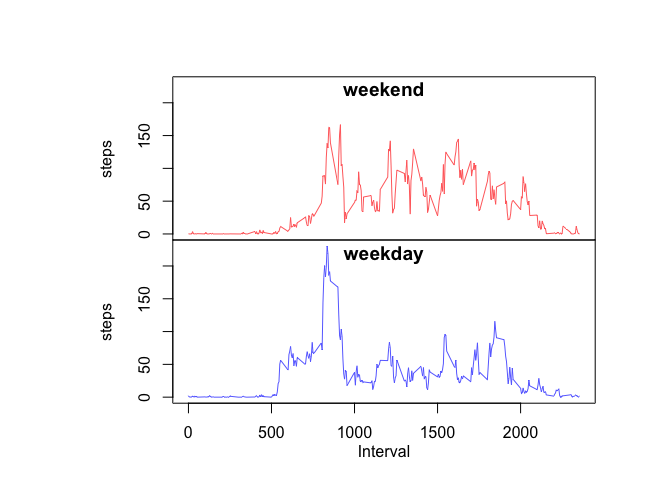

# Reproducible Research: Peer Assessment 1

## Library Loading
I'm loading these at the very top because depending on your environment you might get some error messages.  I still think it's important for you to know what's going on, but you shouldn't have to be annoyed in the middle of my analysis.  

- dplyr for summarize functionality.
- lubridate for weekday vs. weekend comparison

```r
library(dplyr)
```

```
## 
## Attaching package: 'dplyr'
```

```
## The following objects are masked from 'package:stats':
## 
##     filter, lag
```

```
## The following objects are masked from 'package:base':
## 
##     intersect, setdiff, setequal, union
```

```r
library(lubridate)
```

```
## 
## Attaching package: 'lubridate'
```

```
## The following object is masked from 'package:base':
## 
##     date
```

## Loading and preprocessing the data

Unzipping the csv file inline.  And taking a look at the high level summary to get a feel for the data.

```r
activity <- read.csv(unzip('activity.zip'), 
                      header = TRUE,
                      na.string = "NA"
                      )

summary(activity)
```

```
##      steps                date          interval     
##  Min.   :  0.00   2012-10-01:  288   Min.   :   0.0  
##  1st Qu.:  0.00   2012-10-02:  288   1st Qu.: 588.8  
##  Median :  0.00   2012-10-03:  288   Median :1177.5  
##  Mean   : 37.38   2012-10-04:  288   Mean   :1177.5  
##  3rd Qu.: 12.00   2012-10-05:  288   3rd Qu.:1766.2  
##  Max.   :806.00   2012-10-06:  288   Max.   :2355.0  
##  NA's   :2304     (Other)   :15840
```


## What is mean total number of steps taken per day?

*Calculate the total number of steps taken per day*   

I'm creating a histogram of steps per day. 

Steps:   
- Take raw data import   
- filter out NA values  
- group by date  
- create a sum of the steps for each date  


```r
sum_steps <- activity %>% 
  filter(!is.na(steps)) %>%
  group_by(date) %>% 
  summarize(steps = sum(steps))

hist(sum_steps$steps, 
     breaks = 20,
     xlab = "Steps per Day",
     ylab = "Frequency", 
     main = "Histogram of Steps per Day") 
```

<!-- -->
 
*Calculate and report the mean and median of the total number of steps taken per day*   
I'm printing out a five number summary to get the mean and median.
 

```r
summary(sum_steps$steps)
```

```
##    Min. 1st Qu.  Median    Mean 3rd Qu.    Max. 
##      41    8841   10760   10770   13290   21190
```

## What is the average daily activity pattern?  

*Make a time series plot (i.e. 𝚝𝚢𝚙𝚎 = "𝚕") of the 5-minute interval (x-axis) and the average number of steps taken, averaged across all days (y-axis)*  

For this I'm going to do a few things.

First, get the mean steps per interval.

```r
mean_interval_steps <- activity %>% 
  filter( !is.na( steps ) ) %>% 
  group_by(interval) %>% 
  summarize(steps = mean(steps) )
```

Then, I'm going to plot the mean steps per interval, with a horizontal line at the max steps value.  

```r
plot(x = mean_interval_steps$interval, 
     y = mean_interval_steps$steps, 
     type ="l",
     ylim = range(mean_interval_steps$steps), 
     xlab = "Interval", 
     ylab = "Mean Steps",
     main = "Mean Steps per Interval across all day"
     )

max_steps <- mean_interval_steps[which.max(mean_interval_steps$steps),]

abline( v = max_steps$interval, 
        col = "red",
        lty = 2)

ticks = c(max_steps$interval)
axis(side = 1, at = ticks, col = "red")
```

<!-- -->

*Which 5-minute interval, on average across all the days in the dataset, contains the maximum number of steps?*  

In this data set the maximum number of steps happens in the **835th** interval.  

## Imputing missing values

*Calculate and report the total number of missing values in the dataset (i.e. the total number of rows with NAs)*  
Calculate the number of missing values in the dataset

```r
num_incomplete <- sum( !complete.cases(activity) )

num_incomplete
```

```
## [1] 2304
```

There are **2304** rows which contain NAs.
  
  
*Devise a strategy for filling in all of the missing values in the dataset. The strategy does not need to be sophisticated. For example, you could use the mean/median for that day, or the mean for that 5-minute interval, etc.*  

I'm going to use mean for each interval to fill in.  I'm not actually even going to try and figure out the optimal way to impute the data right now.  This will be an area for optimization in the future.


*Create a new dataset that is equal to the original dataset but with the missing data filled in.*  


```r
complete_activity <- left_join(activity, mean_interval_steps, by = 'interval') %>%
                                mutate( steps.x = ifelse(!is.na(steps.x), steps.x, steps.y)) %>%
                                rename(steps = steps.x) %>% 
                                select( -steps.y )

summary(complete_activity )
```

```
##      steps                date          interval     
##  Min.   :  0.00   2012-10-01:  288   Min.   :   0.0  
##  1st Qu.:  0.00   2012-10-02:  288   1st Qu.: 588.8  
##  Median :  0.00   2012-10-03:  288   Median :1177.5  
##  Mean   : 37.38   2012-10-04:  288   Mean   :1177.5  
##  3rd Qu.: 27.00   2012-10-05:  288   3rd Qu.:1766.2  
##  Max.   :806.00   2012-10-06:  288   Max.   :2355.0  
##                   (Other)   :15840
```

*Make a histogram of the total number of steps taken each day and Calculate and report the mean and median total number of steps taken per day. Do these values differ from the estimates from the first part of the assignment? What is the impact of imputing missing data on the estimates of the total daily number of steps?*  


```r
complete_sum_steps <- complete_activity %>% 
  group_by(date) %>% 
  summarize(steps = sum(steps))


hist(complete_sum_steps$steps, 
     breaks = 20,
     xlab = "Steps per Day",
     ylab = "Frequency", 
     main = "Imputed Histogram of Steps per Day") 
```

<!-- -->

```r
hist(sum_steps$steps, 
     breaks = 20,
     xlab = "Steps per Day",
     ylab = "Frequency",
     main = "Histogram of Steps per Day") 
```

<!-- -->


```r
summary(complete_sum_steps$steps)
```

```
##    Min. 1st Qu.  Median    Mean 3rd Qu.    Max. 
##      41    9819   10770   10770   12810   21190
```

```r
summary(sum_steps$steps)
```

```
##    Min. 1st Qu.  Median    Mean 3rd Qu.    Max. 
##      41    8841   10760   10770   13290   21190
```

There are many more observations around the means of the the plot now.  I believe this is mostly due to the fact that I filled NA values with means calculated for those same intervals.  


## Are there differences in activity patterns between weekdays and weekends?

I'm using the mean to look at this because the number of days on weekends is less than weekdays.


```r
weekend_abbr = c('Sat', 'Sun')

complete_activity <- complete_activity %>%
                      mutate( date = as.Date(date) ) %>%
                      mutate( weekend =  wday(date, label = TRUE, abbr = TRUE ) %in% weekend_abbr ) %>%
                      mutate( weekend = ifelse( weekend, 'weekend', 'weekday' )) %>%
                      group_by(weekend, interval) %>%
                      summarize( steps = mean(steps)   )
                      

yrange = range( complete_activity$steps )

par( mfrow = c(2, 1))

par(oma=rep(4, 4), mar=c(0,5,0,0))

with( complete_activity[complete_activity$weekend == 'weekend',], plot(interval,steps, 
                                                          type ="l",
                                                          col = "#FF0000AA",
                                                          xaxt='n',
                                                          ylim = yrange) )
title(main = "weekend", line = -1)

with( complete_activity[complete_activity$weekend == 'weekday',], plot(interval,steps, 
                                                              type ="l",
                                                              col = "#0000FFAA",
                                                              ylim = yrange) )
title(main = "weekday", line = -1)

mtext(text="Interval", side=1, line=2, las=1)
```

<!-- -->

It appears as though there's more activity in the early hours of weekdays.  As the day goes on it appears as though there's more sustained activity in the afternoon and evening.
